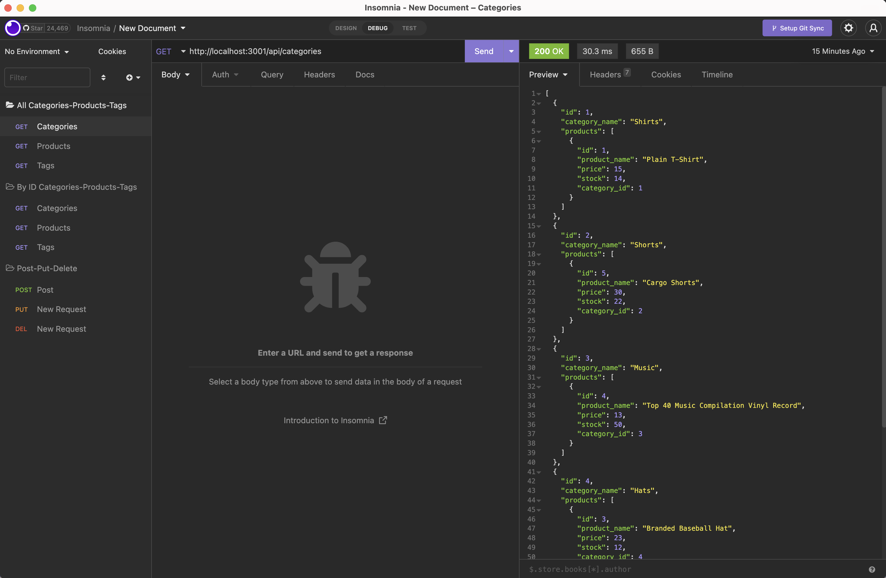
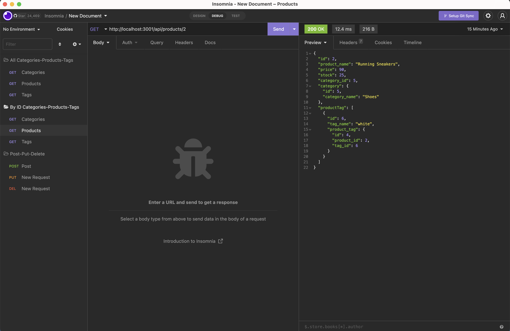
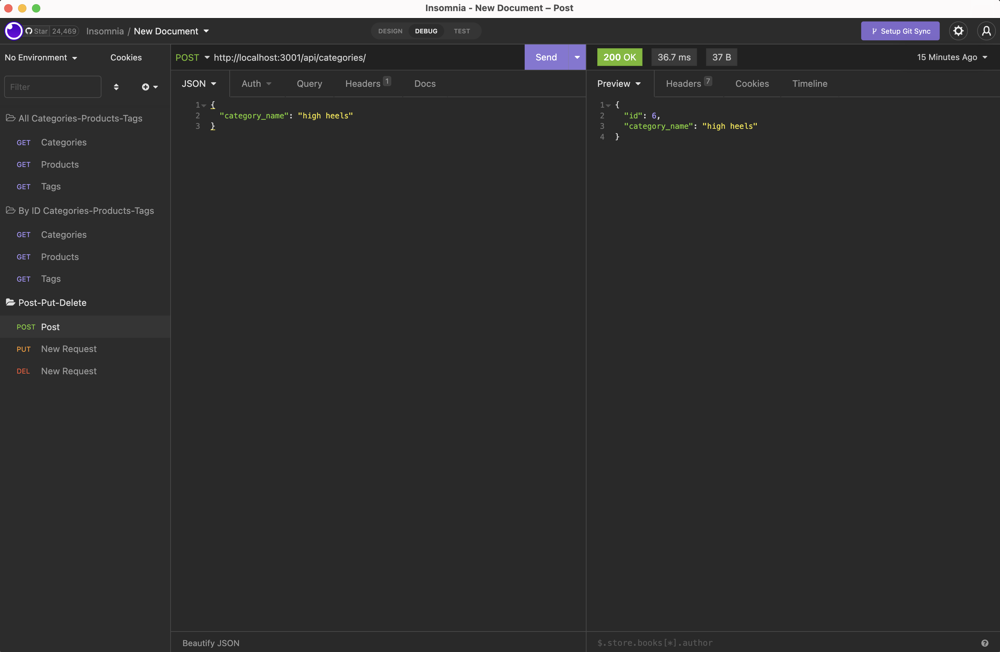

# E-Commerce 
An application for an internet retail company with the latest e-commerce technologies

# Objectives 
-   To create an application that:
    - Has a functional Express.js API
    - Connects to a data base using Sequelize
    - Syncs Sequelize models with MySQL database
    - Displays all data in JSON format through Insomnia 
    - Allows GET, POST, PUT and DELETE routes for all models

# Usage
- Open the command line
- Run `npm i` in order to install all packages from json folder
- Log into MYSQL with `mysql -u root -p`
- In MYSQL run `SOURCE db/schema.sql;`
- Exit MYSQL by running `exit;`
- Seed the data by running `node seeds`
- Run the application with `node server.js`
- Download Insomnia `https://insomnia.rest/download`

# Testing
- Refer to video to see how to test all routes in Insomnia:
    - https://drive.google.com/file/d/1fHhwf6-bNEbvu6F2o-KW66kbLOmbUYSr/view

# Images

